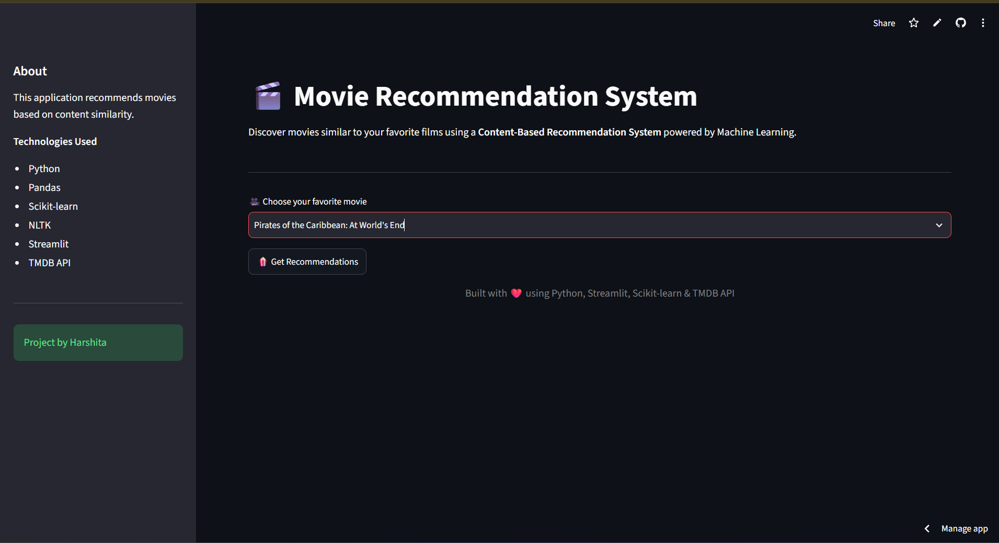
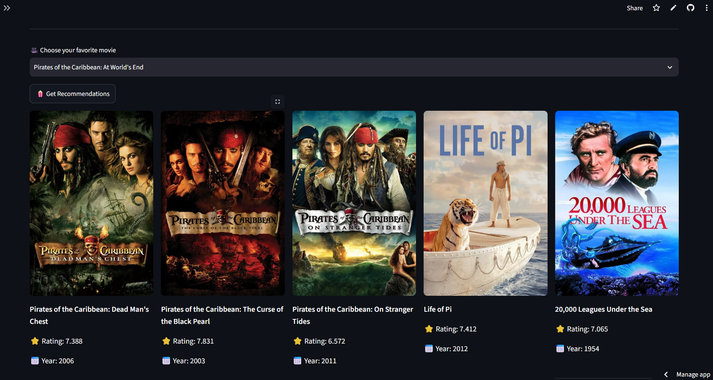
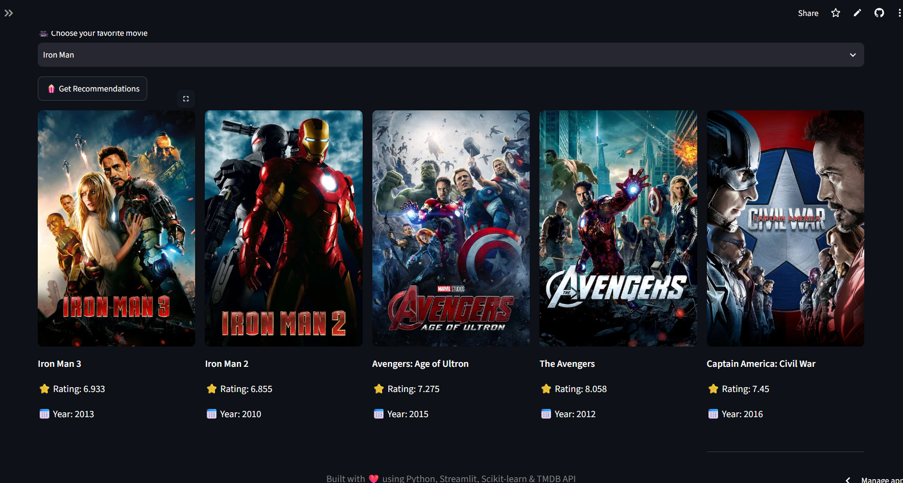

# 🎬 Movie Recommendation System

A Machine Learning based Movie Recommendation System built using **Python, Scikit-learn, Streamlit, and the TMDB API**.

The application recommends movies based on content similarity using **Cosine Similarity** and displays movie posters, ratings, and release years.

---

## 🌐 Live Demo

👉 https://movie-recommendation-system-gqj4wgvnvdfyagepeyrfxv.streamlit.app/

---

## 📷 Screenshots

### Home Page



---

### Recommendations



---

### Example



---

## 🚀 Features

- Content-Based Movie Recommendation
- Interactive Streamlit Web App
- TMDB API Integration
- Movie Posters
- Movie Ratings
- Release Year
- Responsive Interface
- Google Drive Model Download
- Secure API Key using Streamlit Secrets

---

## 🛠️ Technologies Used

- Python
- Pandas
- NumPy
- Scikit-learn
- NLTK
- Streamlit
- Requests
- TMDB API
- Git
- GitHub

---

## 📂 Dataset

TMDB 5000 Movie Dataset

- tmdb_5000_movies.csv
- tmdb_5000_credits.csv

---

## ⚙️ Installation

Clone the repository

```bash
git clone https://github.com/Harshita-084/Movie-Recommendation-System.git
```

Move into the project

```bash
cd Movie-Recommendation-System
```

Install dependencies

```bash
pip install -r requirements.txt
```

Run the application

```bash
streamlit run app.py
```

---

## 📊 Machine Learning Workflow

- Data Cleaning
- Feature Engineering
- NLP Text Processing
- CountVectorizer
- Cosine Similarity
- Recommendation Generation

---

## 👩‍💻 Author

**Harshita**

GitHub:
https://github.com/Harshita-084

---

⭐ Project By Harshita Yadav